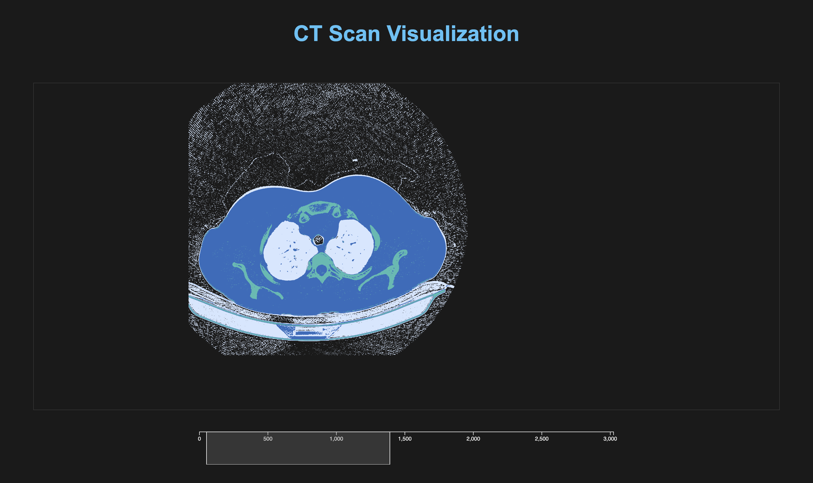

# CT Scan Contour Map Visualization

[Link to GitHub Pages](https://jravikumar97.github.io/CT-Scan-Contour-Map/)

## Overview

This project is a **CT Scan Contour Map Visualization** built using **D3.js**. It loads CT scan data from a CSV file and displays a color-coded contour map based on the pixel intensity values in the scan. The visualization also includes an interactive brush slider, which allows users to dynamically adjust the range of pixel intensities displayed.



### Features
- **Interactive Visualization**: View a CT scan image as a contour map.
- **Dynamic Intensity Filtering**: Use the slider to filter and adjust the pixel intensity range displayed on the contour map.
- **Color-Coded Map**: Different regions of the scan are color-coded based on their intensity, helping to easily distinguish areas of interest.

## Technologies Used
- **HTML/CSS**: Basic webpage structure and styling.
- **JavaScript**: Logic for data loading, processing, and visualization.
- **D3.js v6**: A powerful JavaScript library for data visualization.
- **D3 Contour v2**: A D3.js extension for generating contour plots.

## How It Works

1. **Data Loading**: The visualization reads CT scan data from a CSV file (`Data_CT.csv`), where each value represents the pixel intensity of a particular region in the scan.
2. **Contour Map**: D3.js is used to generate a **contour map** of the scan, where areas with similar intensities are grouped together and color-coded.
3. **Slider Interaction**: Users can interact with a **brush slider** to adjust the intensity range shown on the map. Moving the slider will update the contour map in real-time.

## Project Structure
```
├── index.html              # Main HTML file for the project
├── script.js               # JavaScript logic for the visualization
├── styles.css              # Styling for the webpage
├── data/                   # Directory containing the CSV file
│   └── Data_CT.csv         # CSV file containing the CT scan pixel data
└── Project_ScreenShot.png  # Screenshot of the project
```

## Setup and Installation

### Prerequisites
To run this project locally, you need:
- A modern web browser (Google Chrome, Firefox, etc.)
- Optionally, a local server to serve the HTML file (e.g., using `Live Server` in VSCode)

### Running the Project

1. Clone the repository:
   ```bash
   git clone https://github.com/jravikumar97/CT-Scan-Contour-Map.git
   cd CT-Scan-Contour-Map
   ```

2. Open the `index.html` file in your web browser. If you're using VSCode, you can run it with the **Live Server** extension for a better experience.

3. The project will load the CT scan data from the CSV file and display the contour map visualization.

### Example Data

The `data/Data_CT.csv` file contains a sample set of pixel intensity values from a CT scan. The contour map groups these values into levels, color-coding different intensity regions of the image.

## Usage

1. **Viewing the Contour Map**: When you first open the webpage, a contour map of the CT scan will be generated and displayed in the center.
   
2. **Adjusting the Intensity Range**: Use the brush slider at the bottom of the page to adjust the minimum and maximum intensity values displayed on the map. This allows you to focus on specific regions of the scan based on their pixel intensity.
